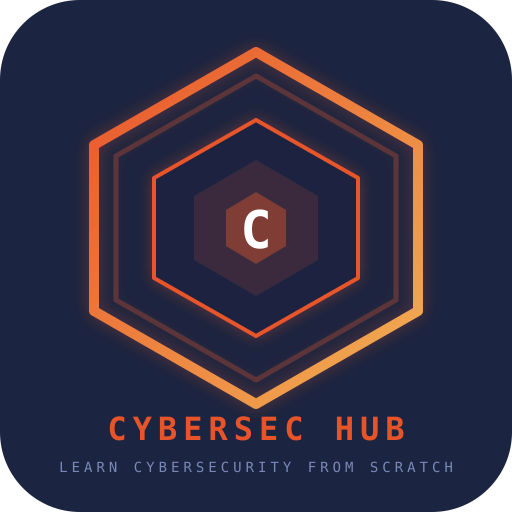

<p align="center">
  
</p>

<h1 align="center">CYBERSEC HUB</h1>

<p align="center">
  <b>Learn Cybersecurity From Scratch</b><br>
  <sub>An Android app that takes you from your first Linux command to job-ready cybersecurity fundamentals</sub>
</p>

<p align="center">
  
  
  
  
  
  
</p>

---

## About

**CyberSec Hub** is a self-contained Android learning platform built for aspiring cybersecurity professionals. It wraps a complete curriculum — from Linux fundamentals to Bug Bounty methodology — into a single offline-capable mobile app with a built-in sandboxed terminal, progress tracking, notes system, and completion certificates.

Whether you're a complete beginner or looking to formalize your self-study, CyberSec Hub gives you a structured, hands-on path through the most important cybersecurity domains.

---

## Features

| Feature | Description |
|---|---|
| **7 Structured Tracks** | Linux & Termux, Networking, Recon & OSINT, Web App Security, System Security, Bug Bounty Methodology, Reporting & Practice |
| **39 Hands-on Lessons** | Each lesson includes detailed written content, a supporting YouTube video, and practice prompts |
| **Sandboxed Terminal** | Built-in practice terminal with commands like `ls`, `cat`, `whoami`, `pkg install` — safe to experiment in |
| **Progress Tracking** | XP system, daily streaks, badges, and per-track progress bars |
| **Notes & To-Do** | Quick note-taking and task management tied to your learning journey |
| **Completion Certificate** | Claim a free certificate once all 7 tracks are cleared |
| **Dark / Light Theme** | Toggle between themes based on your preference |
| **Offline Ready** | Works without internet after initial load — all content is bundled |
| **Animated Splash** | Custom hex-logo splash screen with particle effects and scan-line animation |
| **Immersive Mode** | Full-screen experience with hidden system bars |

---

## Tracks

| # | Track | Lessons | Focus |
|---|---|---|---|
| 01 | Linux & Termux | 8 | File systems, permissions, shell scripting, SSH, Termux setup |
| 02 | Networking | 7 | OSI model, IP/DNS, HTTP/S, ports, firewalls, packet analysis |
| 03 | Recon & OSINT | 5 | Attack surfaces, passive/active recon, subdomains, info disclosure |
| 04 | Web App Security | 5 | OWASP Top 10, auth mechanisms, injection classes, input validation |
| 05 | System Security | 5 | Encryption, authN vs authZ, misconfigurations, logging, malware |
| 06 | Bug Bounty Method | 5 | Scope reading, responsible disclosure, triage, platforms, portfolios |
| 07 | Reporting & Practice | 4 | Report writing, CVSS scoring, professional communication, career paths |

---

## Tech Stack

- **Platform:** Android (API 21+ / Android 5.0+)
- **Language:** Java
- **UI Layer:** WebView with custom JavaScript bridge
- **Splash:** Custom Canvas-based animated hex logo
- **Curriculum:** Self-contained HTML/CSS/JS (~96KB)
- **Build:** Termux CLI (`aapt`, `javac`, `d8`, `zipalign`, `apksigner`)
- **Package:** `com.cybersec.hublearn`
- **App Name:** `cybersec-hub`

---

## Project Structure

```
cybersec-hub/
├── README.md
├── LICENSE
├── build-apk.sh                 # One-command APK build script
├── logo.svg                     # App logo (SVG)
├── banner.png                   # Social preview banner
├── cyberlearn-website.html      # Source webapp (1516 lines)
└── android/
    ├── AndroidManifest.xml
    ├── assets/
    │   └── index.html           # Bundled webapp
    ├── res/
    │   ├── drawable/            # Adaptive icon XML
    │   ├── mipmap-*/            # Launcher icons (5 densities)
    │   └── values/styles.xml    # Dark theme
    ├── src/com/cybersec/hublearn/
    │   ├── MainActivity.java    # WebView wrapper + JS bridge
    │   └── SplashActivity.java  # Animated hex splash screen
    └── toolz/
        └── android.jar          # Android SDK (not in git)
```

---

## Getting Started

### Prerequisites

- [Termux](https://f-droid.org/en/packages/com.termux/) (recommended) or any Linux environment
- Android SDK build tools (install via `pkg install aapt apksigner` in Termux)
- JDK 8+ (`pkg install openjdk-17`)

### Build

```bash
# Clone the repository
git clone https://github.com/Tauseef666-ctrl/cybersec-hub.git
cd cybersec-hub

# Build the APK
chmod +x build-apk.sh
./build-apk.sh
```

The signed APK will be generated at `android/cybersec-hub.apk`.

### Install

```bash
# Copy to shared storage and open
cp android/cybersec-hub.apk ~/storage/shared/
termux-open ~/storage/shared/cybersec-hub.apk
```

Or transfer the APK to your Android device and install it directly (enable "Install from unknown sources" in settings).

---

## Permissions

| Permission | Purpose |
|---|---|
| `INTERNET` | Load YouTube lesson videos |
| `ACCESS_NETWORK_STATE` | Detect online/offline status |
| `VIBRATE` | Haptic feedback on interactions |
| `WAKE_LOCK` | Keep screen on during study sessions |

---

## How It Works

CyberSec Hub is built as a **WebView-wrapped Android app**:

1. **SplashActivity** draws an animated hexagonal logo with floating particles and a scan-line effect on a custom Canvas
2. **MainActivity** loads the bundled `index.html` into a fullscreen WebView with:
   - JavaScript bridge (`AndroidBridge`) for native features (clipboard, vibration, file I/O, toast notifications)
   - Immersive mode (hidden status/navigation bars)
   - Download handling via Android DownloadManager
3. The **webapp** handles all curriculum logic, progress persistence (localStorage), terminal emulation, and UI rendering

---

## Curriculum Content

Each lesson covers a specific topic with:

- **Written explanation** — clear, beginner-friendly breakdowns
- **Supporting video** — curated YouTube lecture embedded in-app
- **Lab notes** — hands-on practice suggestions for legal environments (OWASP Juice Shop, TryHackMe, etc.)
- **Practice terminal** — try commands safely in the sandbox
- **Completion tracking** — mark lessons done to earn XP and advance

---

## Made by

**Tauseef Khan**

---

## Contributing

Contributions are welcome. If you'd like to:

- Add new tracks or lessons
- Fix bugs or improve the build process
- Enhance the splash screen or UI

1. Fork the repository
2. Create a feature branch (`git checkout -b feature/my-feature`)
3. Commit your changes (`git commit -m 'Add my feature'`)
4. Push to the branch (`git push origin feature/my-feature`)
5. Open a Pull Request

---

## License

This project is open source. See the [LICENSE](LICENSE) file for details.

---

<p align="center">
  
  <br>
  <sub>Built for the cybersecurity community</sub>
</p>
