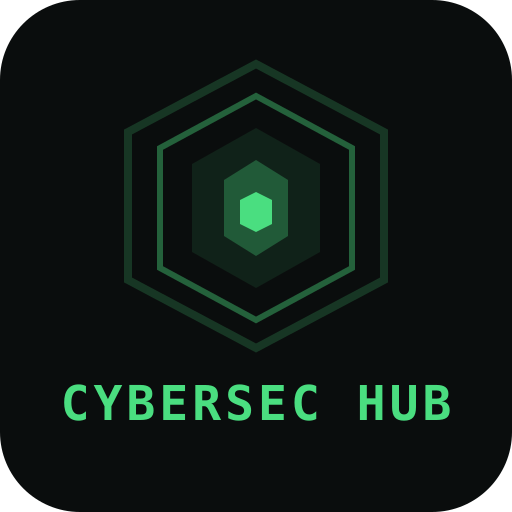
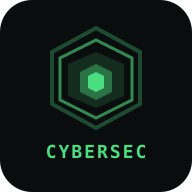

<p align="center">
  
</p>

<h1 align="center">CyberSec Hub</h1>

<p align="center">
  <strong>Learn Cybersecurity From Scratch — On Your Phone, Offline</strong>
</p>

<p align="center">
  
  
  
  
</p>

<p align="center">
  <a href="https://cybersec-hub-website.netlify.app">
    
  </a>
  <a href="https://github.com/Tauseef666-ctrl/cybersec-hub/releases">
    
  </a>
</p>

---

## What Is This?

**CyberSec Hub** is a self-contained cybersecurity learning platform packaged as a native Android app. It delivers a **complete cybersecurity course with 25 in-depth sections** — covering everything from the CIA Triad and Linux fundamentals to exploitation, malware analysis, digital forensics, red/blue teaming, and career guidance — all running **100% offline** on your phone. No server, no internet required after install. Just open the app and start learning.

Built as a single-page vanilla HTML/CSS/JS web application wrapped in an Android Java WebView shell, CyberSec Hub is designed to be lightweight, fast, and accessible to anyone with an Android device. Whether you're a complete beginner or an intermediate learner, the structured curriculum, interactive quizzes, and built-in sandbox terminal give you a hands-on cybersecurity lab that fits in your pocket.

---

## Download

> **🌐 Live website (web view):** [cybersec-hub-website.netlify.app](https://cybersec-hub-website.netlify.app) — updated automatically on every push to this repo.

| Platform | Format | Link |
|----------|--------|------|
| Android | APK | [**Download v3.2.0**](../../releases/latest) |
| Windows | Portable EXE | [**Download v3.2.0**](../../releases/latest) |
| Windows | Installer (NSIS) | [**Download v3.2.0**](../../releases/latest) |
| Linux | AppImage | [**Download v3.2.0**](../../releases/latest) |
| Linux | DEB | [**Download v3.2.0**](../../releases/latest) |

> **Android**: Requires Android 5.0+ (Lollipop). Install the APK directly.
> **Windows 11/10**: Download the portable archive, extract it, and run `CyberSec Hub.exe`. No installation needed.
> **Linux**: Run the `.AppImage` (any distro) or install the `.deb` (Debian/Ubuntu).

---

## Screenshots

The app features a dark hacker-themed UI with green, cyan, and purple accents:

- **Home Screen** — Matrix rain animation, boot terminal, course stats, and quick-start guide
- **Course Sections** — 25 topics with subtopics, code blocks, collapsible details, and inline quizzes
- **Sandbox Terminal** — Floating, draggable, resizable terminal with 20+ simulated commands
- **Progress Tracking** — Ring progress, streak counter, per-section completion, and cloud sync
- **Navigation** — Sidebar, bottom nav bar, breadcrumbs, global search, and keyboard shortcuts

---

## Features

### Learning Content
- **25 cybersecurity sections** covering:
  - Foundations, Linux, Termux, Networking
  - Reconnaissance & OSINT, Scanning & Enumeration
  - Ethical Hacking, Exploitation, Post-Exploitation
  - Privilege Escalation, Bug Bounty, Essential Tools
  - Web Application Security, Operating System Security
  - Malware Analysis, Digital Forensics, Cryptography
  - Wireless Security, Cloud Security, Mobile Security
  - Red Teaming, Blue Teaming, Home Lab Setup
  - Career Guidance, Legal & Ethics
- **Interactive quizzes** with instant feedback, explanations, and streak tracking
- **234 code blocks** with one-tap copy buttons
- **173 collapsible sections** for organized content delivery
- **Embedded YouTube video** thumbnails for supplementary learning
- Terminal-style code boxes with traffic-light dots

### Sandbox Terminal
- **Floating, draggable, resizable** — works anywhere in the app
- **20+ built-in commands**: `help`, `ls`, `cat`, `whoami`, `nmap`, `ping`, `curl`, `ifconfig`, `netstat`, `ps`, `netstat`, `hash`, `base64`, `sudo`, `tree`, `score`, and more
- Keyboard-aware — stays visible above the Android keyboard
- Maximize mode for full-screen terminal
- Command history with arrow key navigation and tab completion

### Progress Tracking
- Per-section completion checkboxes
- SVG progress ring with percentage display
- Quiz streak counter with fire animation
- **localStorage persistence** — progress survives app restarts
- **Shareable sync links** — QR code + URL for cross-device backup/restore
- **Export/Import** JSON data for full data portability

### Navigation & UI
- Sidebar with collapsible chapter groups
- Top bar with back/forward history navigation
- Bottom navigation bar (Home, Topics, Labs, Progress) with active glow indicator
- Breadcrumb trail
- Global search (`Ctrl+K`)
- Keyboard shortcuts modal (`?`)
- Dark hacker theme with Matrix rain canvas animation
- Boot-up typewriter animation on launch
- Confetti on correct quiz answers
- Toast notifications
- Card parallax tilt on hover
- Scroll-triggered content reveal animations
- Ripple effects on buttons
- Responsive design (phone, tablet, desktop, landscape)

---

## Tech Stack

| Layer | Technology |
|-------|-----------|
| Frontend | Vanilla HTML/CSS/JS (no frameworks) |
| Styling | CSS custom properties, 40+ keyframe animations, flexbox/grid |
| Android Shell | Java WebView (API 21+) with JavaScript bridge |
| Desktop Shell | Electron (Windows EXE, macOS DMG, Linux AppImage/deb) |
| Splash Screen | Custom animated Canvas rendering |
| Build (Android) | Shell script using `aapt`, `javac`, `d8`, `zipalign`, `apksigner` |
| Build (Desktop) | electron-builder (NSIS, DMG, AppImage) |
| Storage | localStorage (client-side) |
| Sync | Base64-encoded shareable URLs with QR codes |
| PWA | Service worker for offline web caching |

---

## Project Structure

```
cybersec-hub/
├── shell_top.html              # CSS + HTML header/nav/terminal markup
├── sections.html               # All 25 course sections (content)
├── shell_bot.html              # All JavaScript (nav, quizzes, terminal, sync)
├── index.html                  # Combined output (shell_top + sections + shell_bot)
├── server.js                   # Local Node.js dev server
├── start.sh                    # Auto-restart server script
├── build-apk.sh                # Android APK build script
├── build-electron.sh           # Windows/macOS/Linux Electron build script
├── package.json                # Electron + electron-builder config
├── manifest.json               # PWA manifest
├── sw.js                       # Service worker
├── icon-192.svg                # App icon (192x192)
├── icon-512.svg                # App icon (512x512)
├── hackacademy-prototype.jsx   # React prototype (reference only)
├── electron/
│   ├── main.js                 # Electron main process
│   ├── preload.js              # Preload script (context bridge)
│   ├── generate-icon.js        # Icon generator (pure Node.js)
│   └── icon.png                # Generated app icon (256x256)
└── android/
    ├── AndroidManifest.xml
    ├── CyberSecHub.apk          # Built APK
    ├── src/com/cybersec/hub/
    │   ├── MainActivity.java    # WebView wrapper + AndroidBridge
    │   └── SplashActivity.java  # Animated splash screen
    ├── res/
    │   ├── drawable/            # Adaptive icon
    │   └── mipmap-*/            # Launcher icons (all densities)
    ├── assets/
    │   ├── index.html           # Copied from root
    │   ├── boot.wav             # Boot sound effect
    │   ├── fonts/               # JetBrains Mono + Inter
    │   ├── manifest.json        # PWA manifest
    │   ├── sw.js                # Service worker
    │   └── icon-*.svg           # Icons
    └── toolz/android.jar        # Android SDK stub for compilation
```

---

## Building

### Android APK

#### Prerequisites
- Linux or [Termux](https://f-droid.org/en/packages/com.termux/) environment
- Android build tools: `aapt`, `javac`, `d8`, `zipalign`, `apksigner`

#### Build Steps
```bash
# 1. Concatenate source files into index.html
cat shell_top.html sections.html shell_bot.html > index.html

# 2. Copy to Android assets
cp index.html android/assets/

# 3. Build the APK
bash build-apk.sh
```

**Output:** `android/CyberSecHub.apk`

#### Install on Android
```bash
# Copy to shared storage
cp android/CyberSecHub.apk ~/storage/shared/

# Open with package installer
termux-open ~/storage/shared/CyberSecHub.apk
```

---

### Windows / macOS / Linux (Electron)

The same web app can be packaged as a native desktop application for **Windows (EXE installer)**, **macOS (DMG)**, and **Linux (AppImage/deb)**.

#### Prerequisites
- [Node.js](https://nodejs.org/) 18+
- npm (ships with Node.js)

#### Build Steps
```bash
# 1. Generate index.html from sources
cat shell_top.html sections.html shell_bot.html > index.html

# 2. Install dependencies and build
bash build-electron.sh
```

Or step by step:
```bash
cat shell_top.html sections.html shell_bot.html > index.html
npm install
npx electron-builder --win       # Windows EXE
npx electron-builder --linux     # Linux AppImage/deb
npx electron-builder --mac       # macOS DMG
```

**Output:** `release/` directory containing the installer(s).

#### Run Locally (Development)
```bash
cat shell_top.html sections.html shell_bot.html > index.html
npm start
```

---

## Keyboard Shortcuts

| Shortcut | Action |
|----------|--------|
| `Ctrl+K` | Open search |
| `Ctrl+`` ` | Toggle terminal |
| `?` | Show shortcuts modal |
| `Esc` | Close active panel |
| `Alt+Left` | Navigate back |
| `Alt+Right` | Navigate forward |

---

## Version History

### v3.2.0 (Latest)
- Full course restructure with subtopics, embedded videos, and notes
- Boot sound effect and splash screen improvements
- Video panel with YouTube integration
- Floating terminal with drag, resize, minimize, and keyboard awareness
- Online status indicator
- Cloudflare tunnel support for remote access

### v1.0.0
- Initial release with 25 cybersecurity sections
- Floating draggable/resizable terminal
- Quiz system with streak tracking
- Progress sync via shareable URLs
- Bottom navigation with active glow states

---

## License

**Educational use only.** Built with Termux on Android.

---

<p align="center">
  
  <br>
  <sub>Made with passion for cybersecurity education</sub>
</p>
